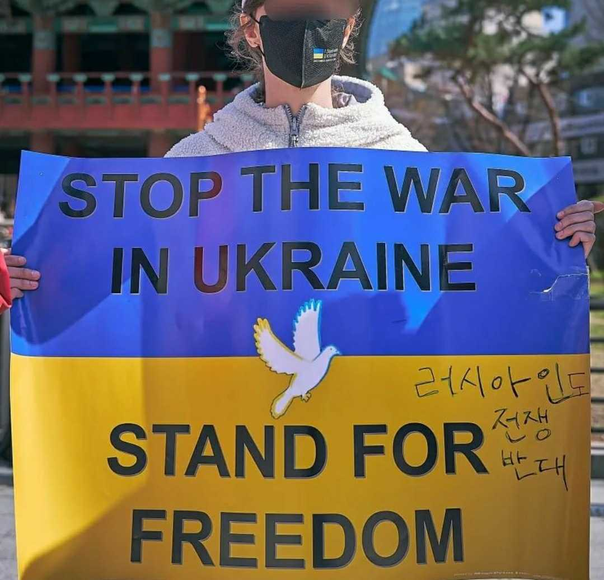
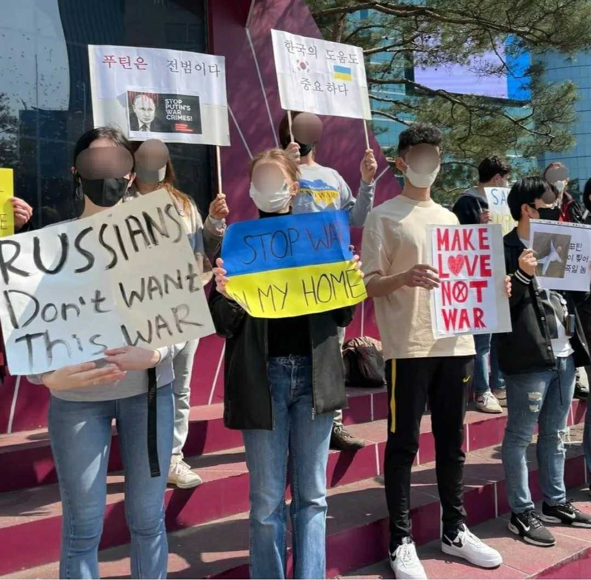
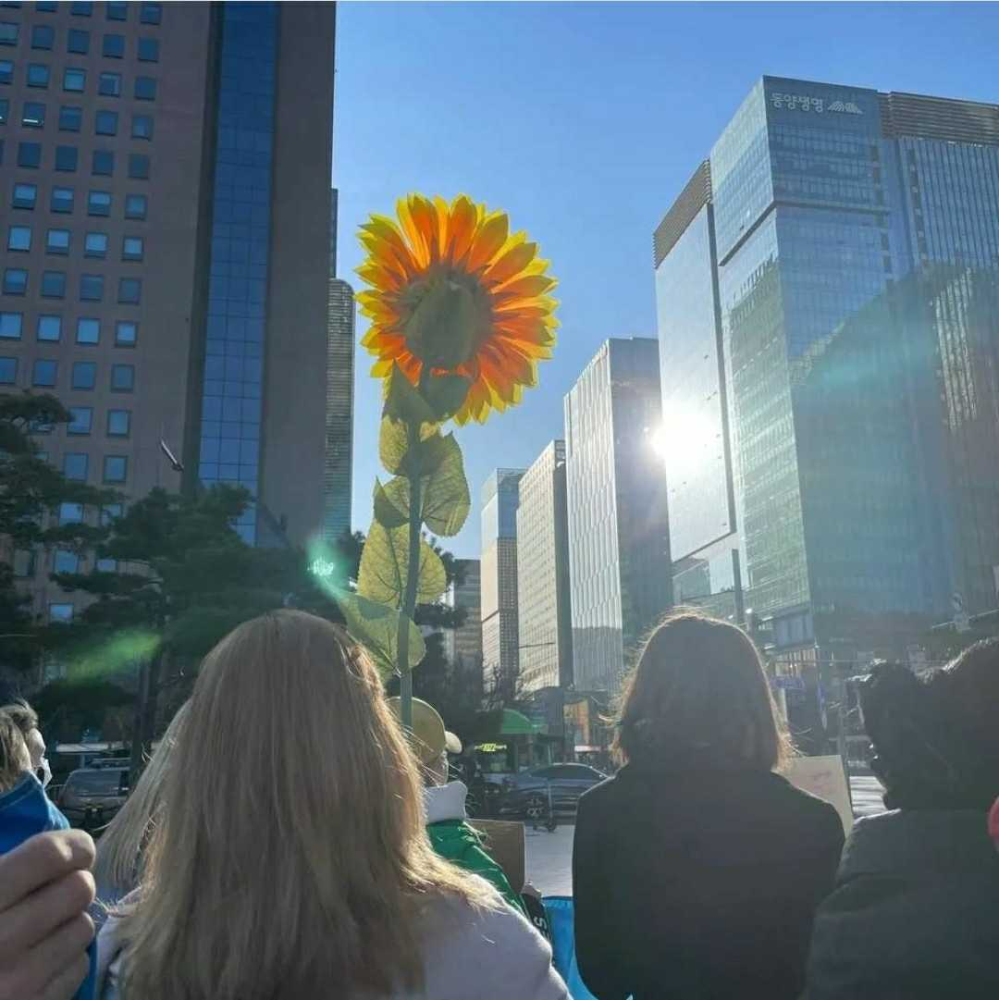

<table border="0">
  <tr>
    <td>
      

        <a href="https://supportukrainenow.org/">우크라이나 돕기</a>
         
        <a href="https://www.instagram.com/voicesinkorea/">
          Instagram 
        </a>
      

    </td>
    <td width="10%">
      
<a href="https://www.voicesinkorea.kr/ru/"> Русский</a>

    </td>
    <td width="10%">
      
<a href="https://www.voicesinkorea.kr/en/"> English</a>

    </td>
  </tr>
</table>
<!--

<a href="https://www.voicesinkorea.kr">
   русский
</a>

-->

<b>전쟁에 반대하는 러시아 사람들의 모임</b>

우리는 블라디미르 푸틴의 파시스트 정권과 악행에 반대하는 러시아인들의 모임입니다. 우리는 자유와 민주주의를 지지합니다.

블라디미르 푸틴이 내린 결정은 국제법을 위반해왔으며, 지금도 위반하고 있습니다. 대표적인 사례로써 2008년 러시아에 의해 촉발된 러시아-조지아 전쟁, 2014년 크림반도 강제병합, 우크라이나 남동부에서 분리주의 세력 촉발 및 지원하여 수년간 지속된 돈바스 전쟁이 있습니다.

&emsp;&emsp;

2022년 2월 24일 블라디미르 푸틴은 억지스러우며 파렴치한 구실로 주권국을 상대로 전쟁을 시작했습니다. 현재 우크라이나에서 벌어지고 있는 전쟁은 수만명이 넘는 사람들의 목숨을 앗아갔으며, 수많은 도시를 파괴했습니다. 천만명이 넘는 우크라이나인들은 자신의 집을 떠나야 했습니다. 이중 많은 사람들은 어떠한 서류나 생활비조차 주어지지 않은채 불법적으로 러시아에 강제이주되었습니다. 강제이주된 사람들 중에서는 부모와 생이별한 아이들도 적지 않습니다.

러시아 정부는 부끄럽게도 현재 우크라이나에서 벌어지는 전쟁을 “우크라이나 내 러시아어 사용인구 수호 특별작전”이라고 명명했습니다. 이에 동의하지 않는 러시아인들은 이 전쟁을 단지 “전쟁”이라고 부르거나, “전쟁 반대”, “파시즘 반대”라는 구호를 외치고 시위했다는 이유만으로 체포되고 있습니다. 우크라이나 전쟁 발발과 동시에 러시아에서는 15,000명이 넘는 사람들이 구금 되었으며, 현재도 구속자 수는 점점 증가하고 있습니다.

&emsp;&emsp;

블라디미르 푸틴이 통치하는 러시아에서 표현의 자유란 존재하지 않으며, 사실상 모든 독립언론사들은 나라를 떠나거나 활동을 중단해야 합니다. 블라디미르 푸틴 치하 러시아는 독재정권이자 정치인이나 언론인, 심지어 평범한 사람조차 자신이 말한 의견만으로도 투옥되거나 독살되고 암살당할 수 있는 나라입니다. 대표적으로 잘 알려진 사례로는 알렉산드르 리트비넨코, 안나 폴릿콥스카야, 안나 바부로바, 보리스 넴초프 암살 등이 있으며, 유리 스크리팔과 블라디미르 카라-무르자, 알렉세니 나발니 독살시도가 있습니다.

우리는 블라디미르 푸틴의 정권을 범죄적이며 비인간적이라고 생각합니다. 푸틴의 악행에 의해 전 세계를 위협하는 억압적인 파시스트 정권이 창조되었습니다.

&emsp;&emsp;

러시아인들의 자유와 민주주의를 나타내는 상징은 우리가 시위에서 함께하는 백청백기입니다. 보다 더 자세한 정보는 이 <a href="https://whitebluewhite.info/korean">사이트</a>에서 찾으실 수 있습니다.

우리가 주관하는 시위에 관한 정보는 <a href="https://www.instagram.com/voicesinkorea/">인스타그램</a>에서 찾으실 수 있습니다.

<b>전쟁에 반대합니다!</b>

